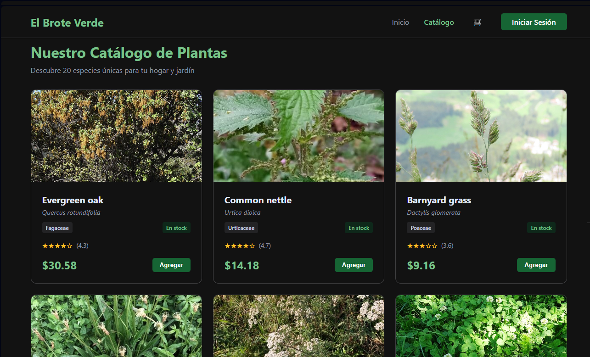
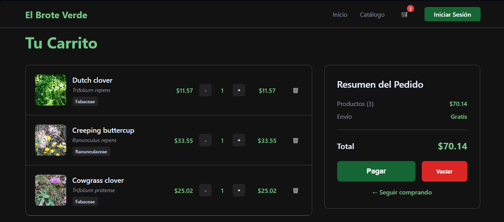

# 🌱 El Brote Verde - E-commerce de Plantas

Una plataforma de e-commerce especializada en plantas, desarrollada como **pre-entrega** para TalentoTech.

## ✨ Características Generales

- **🌿 Catálogo de Plantas**: Consumo de API Trefle para mostrar especies
- **🛒 Carrito de Compras**: Funcionalidades básicas de e-commerce
- **🎨 Diseño Responsive**: Desarrollado con React y CSS
- **🔍 Búsqueda y Filtros**: Navegación intuitiva por el catálogo
- **📱 Interfaz React**: Componentes reutilizables y estado gestionado

## 📚 Contexto del Proyecto y Requisitos de Pre-entrega

### ✅ Requerimientos Implementados

<strong>🛒 Requerimiento #1: Manejo de Carrito de Compras</strong>

- Componente para listar productos disponibles
- Hook `useState` para estado del carrito
- Eventos para agregar productos al carrito
- Componente visual del carrito
- Layout del eCommerce

<strong>🔗 Requerimiento #2: Integración con API</strong>

- Consumo de API Trefle para datos de plantas
- Gestión de estado con `useState`
- Manejo de efectos con `useEffect`
- Estados de carga y manejo de errores
- Actualización del diseño
- Ampliación del carrito

<strong>🛣️ Requerimiento #3: Integración de Rutas</strong>

- Implementación de React Router
- Componentes para cada sección
- Navegación entre productos
- Mejora en estados de carga y errores

<strong>🛡️ Requerimiento #4: Rutas Dinámicas y Protegidas</strong>

- Rutas dinámicas para detalles de producto
- Rutas protegidas para áreas de usuario
- Mejora de interactividad
- Navbar con navegación completa

## 🚀 Próximos Pasos (Proyecto Final)

- [ ] Introducción a la Autenticación de Usuarios.
- [ ] Implementación de formulario de login.
- [ ] Manejo de autenticación con tokens (simulada).
- [ ] Protección de rutas usando Context API para la autenticación. 

## Screenshots de El Brote Verde

### Home Page

### Catalogo Page

### Carrito Page

## Reflexiones finales

### ¿Qué ventajas tiene usar Context API frente a pasar props entre componentes?
- Hace el código más mantenible y limpio, es ventajoso para datos que son necesitados por varios componentes y evita tener que pasar por otros componentes (o lo que comúnmente llaman "prop drilling")

### ¿En qué situaciones sería más conveniente usar Redux en lugar de Context API?
- Para proyectos más grandes, seguramente sea más útil. En este proyecto tiene sólo AuthProvider y CartProvider y la plataforma no necesita tener los datos tan en tiempo real como podria ser otro tipo de e-commerce o negocio.

### ¿Qué problemas podrías enfrentar al manejar múltiples contextos en una misma aplicación?
- Las matrioshkas interminables de contextos...además imagino que se debe de volver más complejo debuggear.

### ¿Cómo podrías optimizar el rendimiento de una aplicación que usa Context API intensivamente?
- Se podria separar contexts, usar useMemo para valores del context, separar state y dispatch, usar custom hooks selectores...
